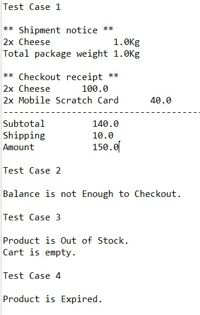

<h1 align='center'>e-commerce system for Fawry task</h1>


## 📙 About 
A simple Java-based e-commerce system with support for perishable and shippable products, cart management, and checkout simulation.


## 📃 Assumptions

1. **Shipping Fees** are calculated as:  
   `10 * total weight of shippable products in the cart`.

2. **All weights** are measured in **kilograms (Kg)**.

3. The `Main` class defines **4 products** for testing:
   - 🧀 **Cheese**: Requires shipping, has expiry date  
     - Price: `50`, Quantity: `3`, Expiry Date: `1-8-2025`, Weight: `0.5 Kg`
   - 📺 **TV**: Requires shipping, does not have expiry date  
     - Price: `5000`, Quantity: `1`, Weight: `10 Kg`
   - 💳 **Mobile Scratch Card**: No shipping , does not have expiry date 
     - Price: `20`, Quantity: `10`
   - 🍪 **Biscuits**: No shipping , has expiry date , **expired**  
     - Price: `20`, Quantity: `5`, Expiry Date: `1-7-2024`

4. The `Main` class defines **4 customers** for testing:
   - 👤 **Customer 1**: Balance `1000`
   - 👤 **Customer 2**: Balance `100`
   - 👤 **Customer 3**: Balance `1000`
   - 👤 **Customer 4**: Balance `1000`

    

## 🏁 Getting Started 

### Installation 

1. **Clone the repository**

```bash
$ git clone [https://github.com/EmanElbedwihy/e-commerce-system.git]
```

2. **Install Extension Pack for Java in VS Code**
   


### Running 

 **Run the following commands in terminal**

```bash
$ javac e_commerce/*.java
$ java e_commerce.Main
```


## 📃 Test Cases 

#### ✅ Test Case 1
- Customer 1 adds 2 cheese products and 2 mobile scratch cards then checks out → ✅ Success

#### ❌ Test Case 2
- Customer 2 adds 1 TV product → ❌ Failure (balance not enough)

#### ❌ Test Case 3
- Customer 3 adds 2 cheese → ❌ Failure (out of stock becuase customer 1 bought 2 cheese so only 1 cheese is in stock)
- Then tries to checkout → ❌ Failure (cart is empty)

#### ❌ Test Case 4
- Customer 4 adds 1 biscuits → ❌ Failure (product is expired)


   
   


